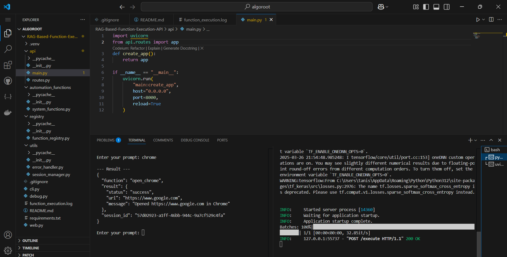
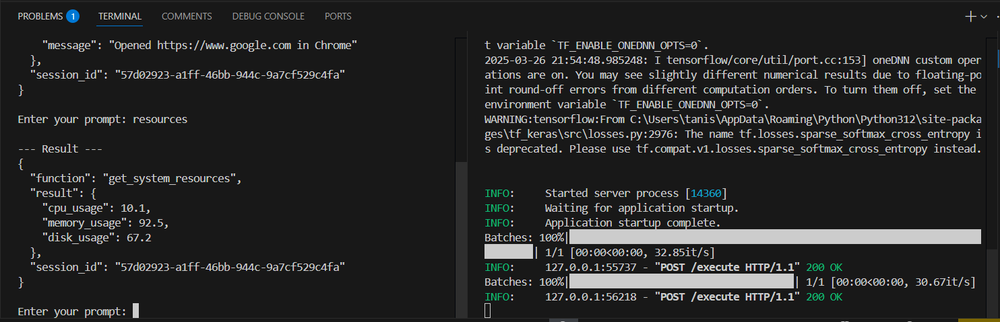
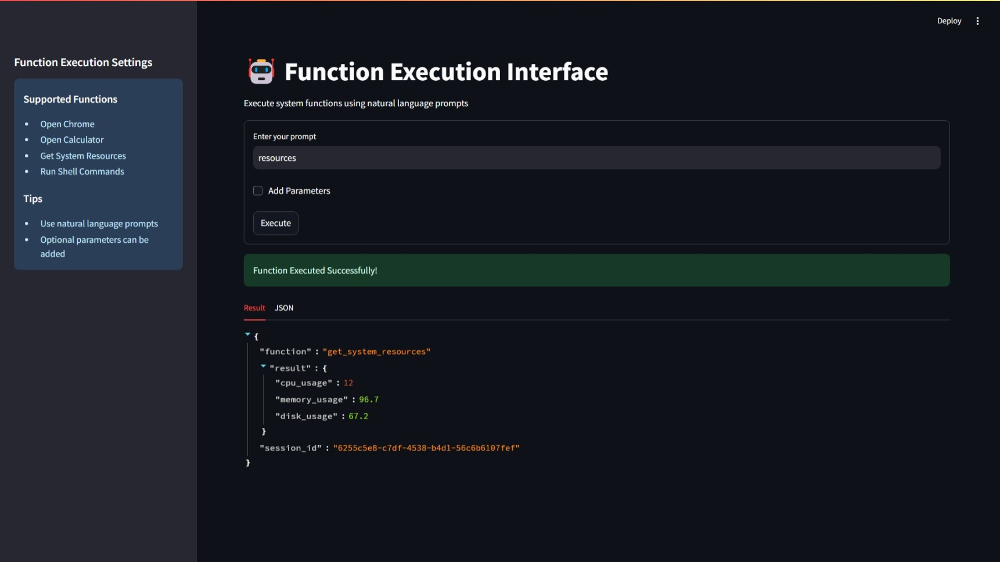

# 🤖 Function Execution API

## Overview
An intelligent system that transforms natural language prompts into actionable system automation tasks using advanced semantic search and machine learning techniques.

## 🌟 Key Features
- **Semantic Function Discovery**: Intelligently map user prompts to system functions
- **Dynamic Function Execution**: Execute system commands through natural language
- **Session-Based Memory**: Maintain context across interactions
- **Comprehensive Error Logging**: Robust error tracking and management
- **Multi-Interface Support**: CLI, Web, and API interfaces

## 🛠 System Requirements
- Python 3.8+
- Windows, macOS, or Linux

## 📦 Installation

### 1. Clone the Repository
```bash
git clone https://github.com/yourusername/function-execution-api.git
cd function-execution-api

``` 
### 2. Create Virtual Environment
```bash
python -m venv .venv
```
Activate virtual environment
- Windows ```.venv\Scripts\activate ```

- macOS/Linux ```source .venv/bin/activate```

### 3. Install Dependencies
```pip install -r requirements.txt```


## 🚀 Running the Application
### Run FastAPI server
```uvicorn api.routes:app --reload```

### Command Line Interface
- Interactive CLI mode
```python cli_interface.py -i ```

- Single command execution
```python cli_interface.py -p "Open Chrome" ```


## Web Interface
### Launch Streamlit web interface
```streamlit run web_interface.py```


### 🔍 Usage Examples
1. API Endpoint

- Open Chrome
``` bash
curl -X POST http://localhost:8000/execute \
     -H "Content-Type: application/json" \
     -d '{"prompt": "Open Chrome", "params": {"url": "https://www.google.com"}}'
```

- Get System Resources
```bash
curl -X POST http://localhost:8000/execute \
     -H "Content-Type: application/json" \
     -d '{"prompt": "Check system performance"}'
```


# Prompt examples
```
> Open Chrome
> Open Calculator
> Check system resources
> Run shell command | {"command": "ls -l"}
```

- Streamlit Web Interface
Enter natural language prompts
Optional parameter configuration
Real-time result visualization

🧩 Supported Functions
Open Chrome/Browser
Open Calculator
Get System Resources
Run Shell Commands

🔧 Customization
Easy to add new system functions
Extensible semantic search
Configurable logging

📊 Performance Metrics
Low-latency function execution
Efficient semantic matching
Minimal system resource overhead


Here is a sample output image illustrating the results:




